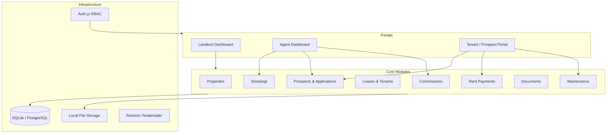
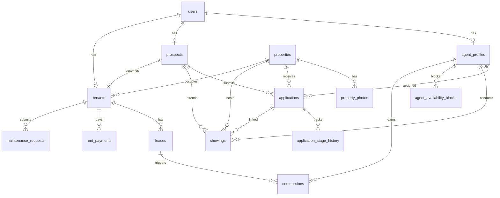
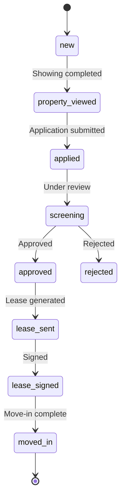

# PlayaStays — Architecture

## Location / City model

Every property has a **`location`** field (portfolio city slug) used for filtering, reporting, and dashboards:

| Slug | Display name |
|------|----------------|
| `playa_del_carmen` | Playa del Carmen |
| `puerto_morelos` | Puerto Morelos |
| `tulum` | Tulum |
| `cozumel` | Cozumel |
| `isla_mujeres` | Isla Mujeres |
| `xpu_ha` | Xpu-Ha |
| `other` | Other |

The landlord dashboard reads `?city=` query param (`all` or a slug). Portfolio queries in `src/lib/queries/portfolio.ts` filter all metrics by location when set.

## System overview

## Entity relationship diagram

## Application workflow

When stage reaches **lease_signed**:
1. User role updates `prospect` → `tenant`
2. `tenants` record created (links back to `prospect` + `application`)
3. `commissions` record created for assigned agent
4. Property status → `occupied`

## Role-based access

| Resource            | Landlord | Agent (assigned) | Prospect | Tenant |
|---------------------|----------|------------------|----------|--------|
| All properties      | ✓        | read (listed)    | read     | own    |
| All prospects       | ✓        | assigned only    | own      | —      |
| Financials (full)   | ✓        | commission only  | —        | own rent |
| Agent profiles      | ✓        | own              | —        | —      |
| Maintenance         | ✓        | —                | —        | own    |
| Documents           | ✓        | assigned         | own app  | own    |

Enforced in:
- `src/middleware.ts` — route-level role checks
- Server actions / API routes — query filters by `assignedAgentId` or `userId`

## Key design decisions

1. **Money in cents** — All MXN amounts stored as integers (cents) to avoid float issues.
2. **Prospect history preserved** — `tenants.prospectId` keeps link to original application data.
3. **Multi-property search** — One `applications` row per prospect + property pair; different agents per property allowed.
4. **Polymorphic documents** — Single `documents` table with `entityType` + `entityId` for flexible attachments.
5. **SQLite first** — Zero-config local dev; Postgres migration path via Drizzle dialect swap.

## Module roadmap (implementation phases)

| Phase | Scope |
|-------|-------|
| ✅ 1 | Schema, auth, roles, dashboard shells |
| 2 | Properties CRUD + photo upload |
| 3 | Prospects, applications, screening workflow |
| 4 | Showings + FullCalendar + agent availability |
| 5 | Leases, tenant conversion, commissions |
| 6 | Rent payments + maintenance portal |
| 7 | Email reminders (renewals, overdue rent) |

## Mexico-specific fields

Properties use flexible address components instead of a single `address` string:

| Field   | Example        |
|---------|----------------|
| calle   | Av. Reforma 123 |
| colonia | Juárez         |
| ciudad  | Ciudad de México |
| estado  | CDMX           |
| cp      | 06600          |
| pais    | México         |

Rent payments support SPEI reference tracking via `reference` and `paymentMethod` fields.
